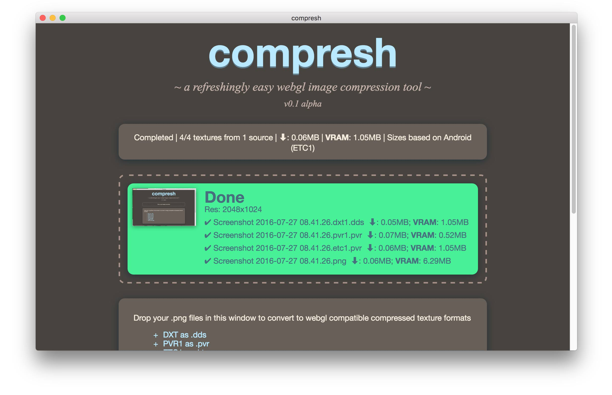

# Compresh v0.1 alpha
A refreshingly easy WebGL image compression tool.

### What it is?
Compresh makes converting to device specific GPU compressed image formats drag-and-drop easy. GPU compressed images allow more textures in memory at once than regular image formats like jpg or png, at close to the same download size (assuming the server is setup to auto gzip files). Compresh is currently in alpha and has limited options.

### Why Compresh?
Compressing to different webgl texture formats requires an artist to install multiple tools, for multiple formats, which are different depending on the device platform, and with a plethora of options. Compresh tries to simplify that process to make the conversion process quick and easy, creating all necessary formats for different devices with appropriate options depending on the supplied images, so artists can get back to doing what they love rather than doing a bunch of busy work.

### Install Instructions
- Download [builds/compresh_osx.tar.gz](https://github.com/MattOstgard/compresh/blob/master/builds/compresh_osx.tar.gz?raw=true)
- Unzip the file and then copy the Compresh app to your Applications folder

### Usage
- Just drag and drop .png images or folders onto the window and Compresh will automatically begin converting
- Multiple formats for different devices will be placed in a folder called "compressed" within each source images folder. It also creates a quantized png (very small lossy png) as well as preview png images so you can view the quality (this will be part of the GUI later).
- After conversion, size reports will be displayed for download size (assuming the server is setup to gzip everything) and video memory (VRAM) for each image as well as totals for all images.

### Extra tid-bits
- Currently only runs on OS X. Windows support coming.
- The defaults are setup to work with pixi.js and pixi-compressed-textures plugin which expect premultiplied textures. Phaser currently (July 2016) does not have a compressed texture plugin but will likely expect premultiplied images as well.
- It automatically detects if an alpha channel exists and picks the appropriate format
- If image is not power of two it will automatically resize it to the nearest power of two size.
- PVRTC (iOS format) requires textures to be square and the image will be resized to square based on the largest length between width and height. Other formats will not be made square.

### ATC on OS X
ATC is AMD's texture format which is used on some Android phones with Qualcomm chipsets. While Qualcomm chipsets also support ETC1, ATC is preferred because it can store an alpha channel, while ETC1 cannot and requires an extra texture to represent alpha. Compresh does not currently support ATC because third party converters with OSX/Unix support could not be found. There are a couple of things that might have OSX support in the future, but in the meantime OSX users will have to use Wine to install and run Compressonator. Here are instructions:
  1. Download and install [xQuartz](https://www.xquartz.org/) which is required for wine to work.
  2. Download and install [Wine](https://www.winehq.org/download/)
  3. Download [32 bit version of compressonator](http://developer.amd.com/tools-and-sdks/archive/games-cgi/the-compressonator/)
  4. To install compressonator start `Wine Staging`, cd to where you downloaded compressonator, enter `wine msiexec /i Compressonator.2008-12-18-v1.50.1731.msi`
  5. Setup with all of the default settings.
  6. In finder browse to (or press cmd+shift+g and paste this): `~/.wine/drive_c/Program Files/AMD/The Compressonator 1.50/` then double click `TheCompressonator.exe` to run it.
  7. You can now open images and convert them. Access your computer's directories through the `Z:` Drive

### Build Instructions
Compresh is an Electron](https://github.com/electron/electron/blob/master/README.md) app.

To test it just run this form the `src` folder:
`npm install && npm start`

To build it install electron packager:
`https://www.npmjs.com/package/electron-packager`

And run `build.sh` in the `src` directory and it will build to a folder called `builds` in the root folder.

### Attribution
Compresh uses the following technologies:
- [Electron](https://github.com/electron/electron/blob/master/README.md), Copyright (c) 2016 GitHub Inc.
- [Chromium](https://www.chromium.org/), Copyright (c) 2016 The Chromium Authors. All rights reserved.
- [Crunch-OSX](https://github.com/BKcore/crunch-osx), Ported by [Thibaut Despoulain](https://github.com/BKcore), Copyright (c) 2010-2016 Richard Geldreich, Jr. and Binomial LLC
- [PVRTexToolCLI](https://community.imgtec.com/developers/powervr/tools/pvrtextool/), Copyright (c) 2016 Imagination Technologies
